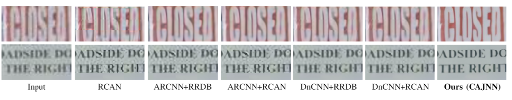

# Boosting-High-Level-Vision-with-Joint-Compression-Artifacts-Reduction-and-Super-Resolution
ICPR-2020

By [Xiaoyu Xiang](https://engineering.purdue.edu/people/xiaoyu.xiang.1), [Qian Lin](https://scholar.google.com/citations?user=LdvJBLYAAAAJ&hl=en), [Jan P. Allebach](https://engineering.purdue.edu/~allebach/),

#### [Paper](https://arxiv.org/pdf/2010.08919) | [Video (YouTube)](https://www.youtube.com/watch?v=9pJZBUWr74c) | [Video (Bilibili)](https://www.bilibili.com/video/BV1GA411476H) | [Poster](./demos/poster.pdf) | [Slides](./demos/slides.pdf)


### Comparison with Previous Methods


### Results of Inputs with Different Quality Factors


### Results on Real-World Images


### Improving Extremely Tiny Face Detection


## Citations
```BibTex
@article{xiang2020boosting,
  title={Boosting High-Level Vision with Joint Compression Artifacts Reduction and Super-Resolution},
  author={Xiang, Xiaoyu and Lin, Qian and Allebach, Jan P},
  journal={arXiv preprint arXiv:2010.08919},
  year={2020}
}
```